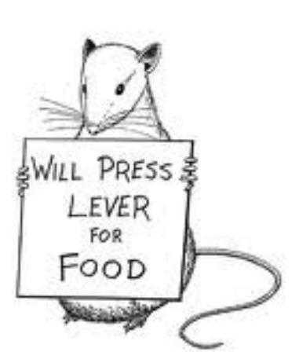
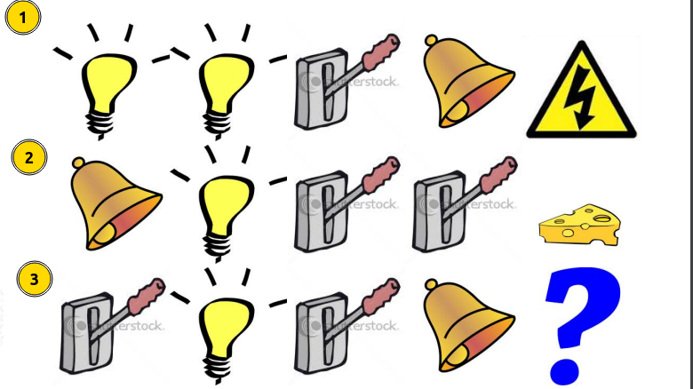

# Lecture-1

| S.N | Resource | Links |
| ---- | ---- | ---- |
| 1. | RL Course by David silver - Lecture 1 | [Video Link](https://www.youtube.com/watch?v=2pWv7GOvuf0&list=PLqYmG7hTraZDM-OYHWgPebj2MfCFzFObQ&index=1) |
| 2. | Course slides - Lecture 1 | [Slides link](https://www.davidsilver.uk/wp-content/uploads/2020/03/intro_RL.pdf) |

>[! quote] fyi 
> 1. What makes reinforcement learning different form other machine learning paradigm?
>- There is no supervisor
 >- only thing we have is the feedback(positive or negative)
 >- reward is rare(sparse feedback) which comes after a long action sequence for eg. in game of chess you win after a full game

----
## Introduction

- Science of Decision Making.
- A trail and error paradigm.
- There is no supervisor but a reward signal which tells how the decisions are.
- Feedback is delayed, not instantaneous.
- Time matters
	- One step after another the decision is made, the action taken for making a decision may have long term consequences
- Agent's action affect the subsequent data it receives.(robot example in physical world)
---
## The Reinforcement Learning Problem
 **Timestamp from the Lecture**: [The RL Problem](https://youtu.be/2pWv7GOvuf0?list=PLqYmG7hTraZDM-OYHWgPebj2MfCFzFObQ&t=1325)
### Reward 
- $R_{t}$ is a scalar feedback signal(Just a number)
- Indicates how well the agent is doing at time stamp $t$.
- The goal of agent is to maximize the overall reward.
- **Reward Hypothesis**: *"All goal can be described by maximizing cumulative reward."* 

**Example**:
Humanoid Robots: +ve reward for movement / -ve reward for falling
Game of chess: +ve reward for winning / -ve reward for losing
Atari Games: +/- ve reward for increasing / decreasing score

> [! quote] FAQ
> 1. Are reward the end of the game is there no intermediate reward?
> 	- There are cases where intermediate reward can be considered.
> 	- In no such cases the reward is the end of the game.
> 2.  What happens if there are no intermediate reward?
> 	- Then we have a end of episode reward defined and then sum of end of the episode is taken and goal of the agent is to maximize the goal at the end of the episode
> 3. what if goal is time based goal? 
> 	- Reward signal is defined as -1 for each time step then
> 	- Stop when you achieve your goal to maximize the reward and reduce the time.

**Timestamp from the Lecture**: [Reward](https://youtu.be/2pWv7GOvuf0?list=PLqYmG7hTraZDM-OYHWgPebj2MfCFzFObQ&t=1379)

---
### Sequential Decision Making

Think of this concept as a unified framework for certain common goal;
"*Select action to maximize total future reward.*"

- *The action may have long term consequences* and *Reward may be delayed* Hence RL Algorithms cannot be *Greedy*.

**Example**: 
- Financial Investment.(spend some money now to get more money later)
- Refueling of aircraft.(stop for refueling which increase time but prevent crashing)
- Thinking of opponent move in games like chess.

**Timestamp from the Lecture**: [Sequential Decision Making](https://youtu.be/2pWv7GOvuf0?list=PLqYmG7hTraZDM-OYHWgPebj2MfCFzFObQ&t=1673)

---
### Agent and Environment

#### Agent
- An entity that is being trained.
- The goal is to build this entity brain. 
- Is responsible for taking action.
- Gets to see a world per step (Observation) and then takes an action and gets feedback based on the action taken to the world (Reward).

#### Environment
- The world where the agent performs actions.
- Every action taken by the agent updates the state of the world and emits the state as observation.
- Gives feedback to the agent based on the action it takes.

#### The Relation Agent and Environment

- **For every time step $t$ the agent:**
	- Performs an Action $A_t$
	- Receives the Observations $O_t$
	- Receives a scalar Reward $R_t$

- **For Every time stamp $t$ the Environment:**
	- Receives an Action $A_t$
	- Emits the Observation $O_t$
	- Provides a scalar Reward $R_t$

**Timestamp form the lecture**: [Agent and Environment](https://youtu.be/2pWv7GOvuf0?list=PLqYmG7hTraZDM-OYHWgPebj2MfCFzFObQ&t=1777)

---
### History and State:
**History**:
- History is the sequence of observation, actions, rewards:

- History up-to timestamp $t$ is determined by sequence, observation and reward all the way till time stamp $t$.
	  $H_{t}=A_1,O_1,R_1,...,A_t,O_t,R_t$

- *"What happens next depends on history"*. which means *Agent selects action based on the history*, *The environment selects observation/reward based on history*.

**State**:
- State is summary of the information used to determine what happens next. 
- State replaces history since it is the summary of all the concise information needed to determine what happens next.
- In RL there are different state definition of state:
	1. Environment State:
	2. Agent State:
	3. Information State:

Formally, State is the function of history. $S_t=f(H_t)$

**Timestamp from the video**: [History and State](https://youtu.be/2pWv7GOvuf0?list=PLqYmG7hTraZDM-OYHWgPebj2MfCFzFObQ&t=2034)
#### Environment State $(S^{e}_{t})$
- Is environment's private representation.
- Internal information used inside the environment to determine what happens next.
	  **Example**: Imagine an environment as an Atari emulator with it's own set of internal representation state which helps emulator to determine next possible decisions to make.

- These state are some set of number that determine what happens next from environment perspective.
- "*The environment state is not usually visible to the agent*". Hence the algorithms does not depend on those numbers.
- Even if it is visible it may be irrelevant information.

`Note:  Environment state does not provide relevant information to build algorithms.` 

#### Agent State $(S^{a}_{t})$
- Is the agent's internal representation.
- Agents internal numerical representation used in algorithms that helps to take next action. 
- It can be any function of history.

#### Information State(Markov State)

- Contains all useful info from the history.     
- The state is Markov if and only if: $$P{[S_{t+1} | S_{t}]} = P[S_{t+1}| S_1,...,S_t]$$"*The future is independent of past given the present*"
- State is sufficient statistics for the future.(meaning history can be ignored.)
- The environment state is Markov
- The history is Markov.
- A Markov state contains all the necessary statistics to give future reward.

**The Rat Example**:
Suppose we have three cases in an environment and a Rat as an Agent.

- The recent history, from last three sequence it is possible to be electricuted.

- what if the state is to count the number of light number and the lever then it is possible to get a cheese.

- However if we consider all of the sequence we might have hard time predicting and we have to perform the action in order to get the outcome.

---
### Fully Observable Environment

- Agent directly observes environment state.(Type of environment where agent sees everything)
  $$O_{t}= S^{a}_{t} = S^{e}_{t}$$
	Agent state = environment state = information state

Formally, this is a <mark style="background: #FF5582A6;">Markov Decision Process(MDP)</mark>

### Partially Observable Environment

- Agent indirectly observes the environment.(Type of environment where agent does not sees everything)
	- **Example**:
	- A robot with camera vision is not told about it's absolute location.
	- A trading agent only observes current prices, and might not know the trends.
	- A poker playing agent who only observes public cards and doesn't know the content of those card.
- *Agent state $\neq$ environment state*

Formally this is a <mark style="background: #FF5582A6;">Partially Observable Markov Decision Process(POMDP)</mark>.
- Agent must build its own state representation $S^{a}_{t}$ (we have to build this state)
	- Making the agent state to remember everything 
	  (Take sequence of complete history $S^{a}_{t} = H_t$ (naive approach))
	- Build beliefs of environment state: 
	  $$S^{a}_{t}=(P[S^{e}_{t=s^1],}...,P[S^{e}_{t}=s^n])$$
	   It is a probabilistic or Bayesian approach where we don't know whats going on the environment but we want to determine where we think we are at the environment based on probabilistic distribution. [Explanation](https://youtu.be/2pWv7GOvuf0?list=PLqYmG7hTraZDM-OYHWgPebj2MfCFzFObQ&t=3245) 
	- Recurrent Neural Network: $S^a_{t} = σ(S^a_{t−1}W_s + O_tW_o )$
	  Agent state at timestamp is determined by a **linear combination of agent state at last time step with latest observation**.

------------ 

## Inside An RL Agent

### Major Components of an RL Agent

- An RL agent may include one or more of the following component:
	- **Policy**: how the agent behaves on what action to take
	- **Value Function**: Tells how good is each state or action
	- **Model**: agent representation of the environment

#### Policy
- A policy is agent's behavior.
- A map from state to action
	- **Deterministic policy**: $a=\pi(S)$
	  Tells us how to get from state $S$ by taking an action(summarizing the situation we are at)
	- **Stochastic Policy**: Probability of taking an action based on being on a certain state
	  $$\pi(a|s) = P[A=a|S=s]$$
	  Useful as it allows us to make random exploratory decision.

#### Value Function
- A Value function is a prediction of future reward.
- this is used to evaluate the goodness/ badness of state (goodness/ badness of a state is determined by how much total reward we are getting when we are at that state)
- Therefore to select between actions,
  $$v_π(s) = E_π[R_t + γR_{t+1} + γ^2R_{t+2} + ... | S_t = s]$$
- Depends upon how the agent is behaving.(depends upon policy)

#### Model
- A model predicts what environment will do next.

---
#### Timestamp from the Lecture-1

| Timestamp | Topics |
| ---- | ---- |
| [6:13](https://www.youtube.com/watch?v=2pWv7GOvuf0&t=373s)  | About Reinforcement Learning |
| [6:22](https://www.youtube.com/watch?v=2pWv7GOvuf0&t=382s)  | Sits in the intersection of many fields of science: solving decision making problem in these fields. |
| [9:10](https://www.youtube.com/watch?v=2pWv7GOvuf0&t=550s)   | Branches of machine learning. |
| [9:37](https://www.youtube.com/watch?v=2pWv7GOvuf0&t=577s)  | Characteristics of RL: no correct answer, delayed feedback, sequence matters, agent influences environment. |
| [12:30](https://www.youtube.com/watch?v=2pWv7GOvuf0&t=750s) | Example of RL   |
|  [21:57](https://www.youtube.com/watch?v=2pWv7GOvuf0&t=1317s)   | The Reinforcement Learning Problem |
| [22:57](https://www.youtube.com/watch?v=2pWv7GOvuf0&t=1377s)  | Reward |
| [27:53](https://www.youtube.com/watch?v=2pWv7GOvuf0&t=1673s)   | Sequential Decision Making. Action |
| [29:36](https://www.youtube.com/watch?v=2pWv7GOvuf0&t=1776s)   | Agent & Environment. Observation |
| [33:52](https://www.youtube.com/watch?v=2pWv7GOvuf0&t=2032s)   | History & State: stream of actions, observations & rewards. |
| [37:13](https://www.youtube.com/watch?v=2pWv7GOvuf0&t=2233s)  | Environment state |
| [40:35](https://www.youtube.com/watch?v=2pWv7GOvuf0&t=2435s)   | Agent State |
| [42:00](https://www.youtube.com/watch?v=2pWv7GOvuf0&t=2520s) | Information State (Markov State). Contains all useful information from history. |
| [51:13](https://www.youtube.com/watch?v=2pWv7GOvuf0&t=3073s)   | Fully observable environment |
| [52:26](https://www.youtube.com/watch?v=2pWv7GOvuf0&t=3146s)   | Partially observable environment |
| [57:04](https://www.youtube.com/watch?v=2pWv7GOvuf0&t=3424s)  | Inside an RL Agent |
| [58:42](https://www.youtube.com/watch?v=2pWv7GOvuf0&t=3522s)  | Policy |
| [59:51](https://www.youtube.com/watch?v=2pWv7GOvuf0&t=3591s)   | Value Function: prediction of the expected future reward. |
| [1:06:29](https://www.youtube.com/watch?v=2pWv7GOvuf0&t=3989s) | Model: transition model, reward model. |
| [1:08:02](https://www.youtube.com/watch?v=2pWv7GOvuf0&t=4082s)   | Maze example to explain these 3 key components. |
| [1:10:53](https://www.youtube.com/watch?v=2pWv7GOvuf0&t=4253s)   | Taxonomy of RL agents based on these 3 key components: policy-based, value-based, actor critic (which combines both policy & values function), model-free, model-based |
| [1:15:52](https://www.youtube.com/watch?v=2pWv7GOvuf0&t=4552s)  | Problems within Reinforcement Learning. |
| [1:16:14](https://www.youtube.com/watch?v=2pWv7GOvuf0&t=4574s)  | Learning vs. Planning. partial known environment vs. fully known environment. |
| [1:20:38](https://www.youtube.com/watch?v=2pWv7GOvuf0&t=4838s) | Exploration vs. Exploitation. |
| [1:24:25](https://www.youtube.com/watch?v=2pWv7GOvuf0&t=5065s)   | Prediction vs. Control. |

---
## Key Terms
| key-terms | Description |
| ---- | ---- |
| Agent | An entity that is being trained. |
| State and observation | A state is complete description of the environment. An Observation $O$ is description of a state. |
| action space | A set of valid action in a given environment |
| Policy: | A rule used by agents to decide what action to take. It is denoted by $\mu$.  Or it may be stochastic, where it is usually denoted by $\pi$ |
| Trajectories | A trajectory $\tau$ is asequence of state and action in the world.  $\tau=(s_0, a_0, s_1, a_1, ...).$ |
| Reward Signal: | In general terms, a reward signal is a numerical reward that the environment sends to the agent after each action and state.  The reward signal tells the agent what are the good and what are the bad decisions. |
| Reward and Return | Reward $R$ is the feedback that is given to the agent when specific action is performed at a particular state and what the next state will be.  $r_t = R(s_t, a_t, s_{t+1})$   The goal of the agent is to maximize the cumulative reward over a trajectory. We will notate such cases with $R(\tau)$ |
| Q-Function | A mathematical equation that estimates the expected reward for taking a specific action in a given state. |
| Value function: | A function of state or state action pair that estimates how good it is for an agent to be in a given state or perform an action in a given state.  It can also be thought as, function that is prediction of future reward.

---

# Lecture-2

## Markov Decision Processes
