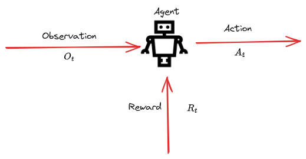
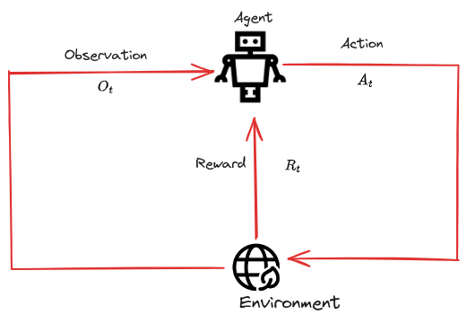

# Lecture-1

| S.N | Resource | Links |
| ---- | ---- | ---- |
| 1. | RL Course by David silver - Lecture 1 | [Video Link](https://www.youtube.com/watch?v=2pWv7GOvuf0&list=PLqYmG7hTraZDM-OYHWgPebj2MfCFzFObQ&index=1) |
| 2. | Course slides - Lecture 1 | [Slides link](https://www.davidsilver.uk/wp-content/uploads/2020/03/intro_RL.pdf) |

>[! quote] fyi 
> 1. What makes reinforcement learning different form other machine learning paradigm?
>- There is no supervisor
 >- only thing we have is the feedback(positive or negative)
 >- reward is rare(sparse feedback) which comes after a long action sequence for eg. in game of chess you win after a full game

----
## Introduction

- Science of Decision Making.
- A trail and error paradigm.
- There is no supervisor but a reward signal which tells how the decisions are.
- Feedback is delayed, not instantaneous.
- Time matters
	- One step after another the decision is made, the action taken for making a decision may have long term consequences
- Agent's action affect the subsequent data it receives.(robot example in physical world)

## The Reinforcement Learning Problem

### Reward 
- $R_{t}$ is a scalar feedback signal(Just a number)
- Indicates how well the agent is doing at time stamp $t$.
- The goal of agent is to maximize the overall reward.
- **Reward Hypothesis**: *"All goal can be described by maximizing cumulative reward."* 

**Example**:
Humanoid Robots: +ve reward for movement / -ve reward for falling
Game of chess: +ve reward for winning / -ve reward for losing
Atari Games: +/- ve reward for increasing / decreasing score

> [! quote] FAQ
> 1. Are reward the end of the game is there no intermediate reward?
> 	- There are cases where intermediate reward can be considered.
> 	- In no such cases the reward is the end of the game.
> 2.  What happens if there are no intermediate reward?
> 	- Then we have a end of episode reward defined and then sum of end of the episode is taken and goal of the agent is to maximize the goal at the end of the episode
> 3. what if goal is time based goal? 
> 	- Reward signal is defined as -1 for each time step then
> 	- Stop when you achieve your goal to maximize the reward and reduce the time.

---
### Sequential Decision Making

Think of this concept as a unified framework for certain common goal;
"*Select action to maximize total future reward.*"

- *The action may have long term consequences* and *Reward may be delayed* Hence RL Algorithms cannot be *Greedy*.

**Example**: 
- Financial Investment.(spend some money now to get more money later)
- Refueling of aircraft.(stop for refueling which increase time but prevent crashing)
- Thinking of opponent move in games like chess.
---
### Agent and Environment

#### Agent
- An entity that is being trained.
- The goal is to build this entity brain. 
- Is responsible for taking action.
- Gets to see a world per step (Observation) and then takes an action and gets feedback based on the action taken to the world (Reward).

#### Environment
- The world where the agent performs actions.
- Every action taken by the agent updates the state of the world and emits the state as observation.
- Gives feedback to the agent based on the action it takes.

#### The Relation Agent and Environment

- **For every time step $t$ the agent:**
	- Performs an Action $A_t$
	- Receives the Observations $O_t$
	- Receives a scalar Reward $R_t$

- **For Every time stamp $t$ the Environment:**
	- Receives an Action $A_t$
	- Emits the Observation $O_t$
	- Provides a scalar Reward $R_t$
---
### History and State:
**History**:
- History is the sequence of observation, actions, rewards:

- History up-to timestamp $t$ is determined by sequence, observation and reward all the way till time stamp $t$.
	  $H_{t}=A_1,O_1,R_1,...,A_t,O_t,R_t$

- *"What happens next depends on history"*. which means *Agent selects action based on the history*, *The environment selects observation/reward based on history*.

**State**:
- State is summary of the information used to determine what happens next. 
- State replaces history since it is the summary of all the concise information needed to determine what happens next.
- In RL there are different state definition of state:
	1. Environment State:
	2. Agent State:
	3. Information State:

Formally, State is the function of history. $S_t=f(H_t)$

#### Environment State $(S^{e}_{t})$

- Is environment's private representation.
- Internal information used inside the environment to determine what happens next.
	  **Example**: Imagine an environment as an Atari emulator with it's own set of internal representation state which helps emulator to determine next possible decisions to make.

- These state are some set of number that determine what happens next from environment perspective.
- "*The environment state is not usually visible to the agent*". Hence the algorithms does not depend on those numbers.
- Even if it is visible it may be irrelevant information.

`Note:  Environment state does not provide relevant information to build algorithms.` 

#### Agent State $(S^{a}_{t})$

- Is the agent's internal representation.
- 
- What info the agent uses to pick next action.
- This is the information used by reinforcement learning algorithms.
- It can be any function of history.

#### Information State(Markov State)

- Contains all useful info from the history.
- The state is Markov if and only if: $$P{[S_{t+1} | S_{t}]} = P[S_{t+1}| S_1,...,S_t]$$"*The future is independent of past given the present*"

---

## Key Terms
| key-terms | Description |
| ---- | ---- |
| Agent | An entity that is being trained. |
| State and observation | A state is complete description of the environment. An Observation $O$ is description of a state. |
| action space | A set of valid action in a given environment |
| Policy: | A rule used by agents to decide what action to take. It is denoted by $\mu$.  Or it may be stochastic, where it is usually denoted by $\pi$ |
| Trajectories | A trajectory $\tau$ is asequence of state and action in the world.  $\tau=(s_0, a_0, s_1, a_1, ...).$ |
| Reward Signal: | In general terms, a reward signal is a numerical reward that the environment sends to the agent after each action and state.  The reward signal tells the agent what are the good and what are the bad decisions. |
| Reward and Return | Reward $R$ is the feedback that is given to the agent when specific action is performed at a particular state and what the next state will be.  $r_t = R(s_t, a_t, s_{t+1})$   The goal of the agent is to maximize the cumulative reward over a trajectory. We will notate such cases with $R(\tau)$ |
| Q-Function | A mathematical equation that estimates the expected reward for taking a specific action in a given state. |
| Value function: | A function of state or state action pair that estimates how good it is for an agent to be in a given state or perform an action in a given state.  It can also be thought as, function that is prediction of future reward. 

------------------------------------

# Lecture-2

## Markov Decision Processes
